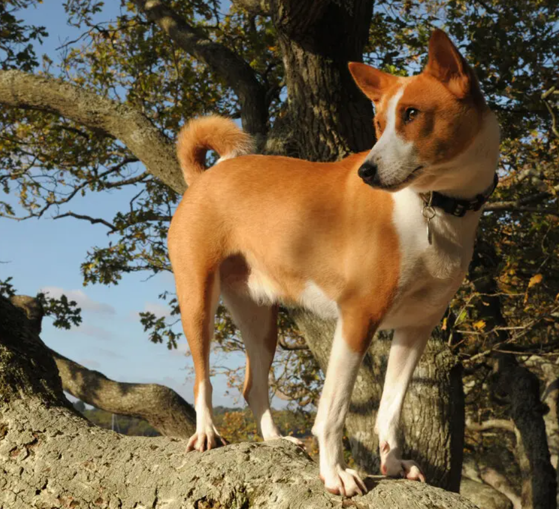

```{r setup, include=FALSE}
knitr::opts_chunk$set(echo = FALSE)
```

## Little bit about myself

Hi!
As the title suggests my name is Samitha Herath. I was born on April 15th 1996 in a city called Kandy in Sri Lanka. I am currently reading for my Masters in Statistics. So, far I'm loving it.

## My favourite Animal

```{r, echo = FALSE, fig.cap = "A picture resembling a past family pet", out.width = "70%"}


```

## Slide with Plot 

```{r pressure, warning=FALSE, message=FALSE}
library(viridis)
library("ggsci")
library(ggplot2)

penguins_data <- read.csv("penguins.csv")

ggplot(penguins_data, aes(bill_length_mm, flipper_length_mm, color=sex))+
  geom_point(size=5, alpha=1/2, shape=10, color="red", fill="yellow") +
  geom_line(color="green", size=2) +
  theme_minimal() +
  ggtitle(label = "Bill length vs Flipper length") +
  labs(y="Flipper length", x="Bill length", caption = "Ugly plot") +
  theme(
    panel.background = element_rect(fill = 'pink'),
    axis.title = element_text(size = 20, color = 'purple'),
    plot.title = element_text(size = 30, face = 'bold', hjust = 0.5, color = 'orange'),
    axis.text = element_text(size = 10, color = 'brown'),
    axis.line = element_line(color = 'pink', size = 2),
    panel.grid.major = element_line(color = 'grey', size = 0.2),
    legend.title = element_text(size = 15, color = 'blue'),
    legend.background = element_rect(fill = 'pink', color = 'red', size = 2)
  )

```

## Link to my CV

```{r CV}

```


